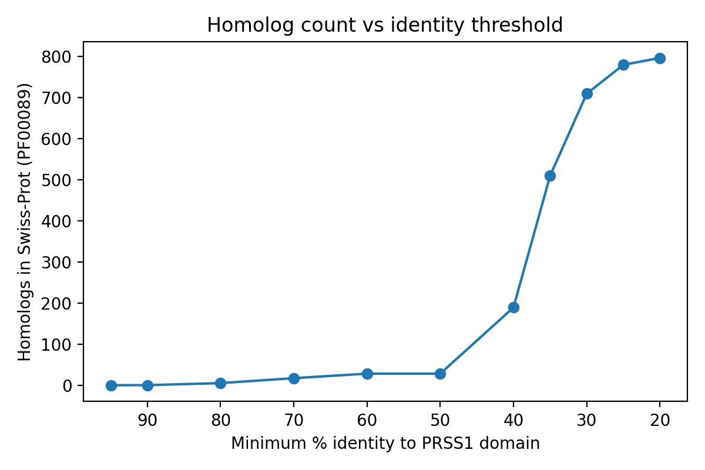
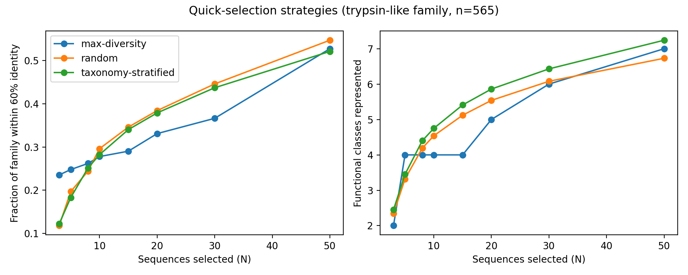
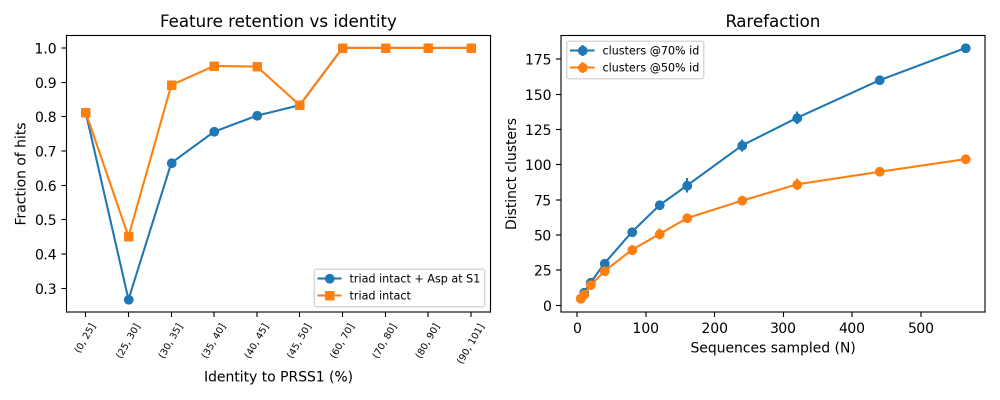
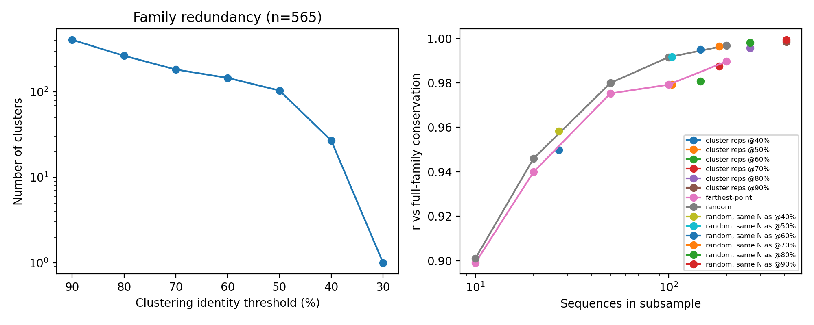
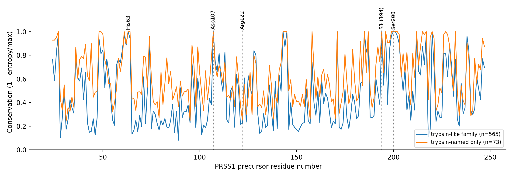

# Defining an empirical family boundary and sampling strategy for trypsin

Akanksha Rajput · October 06, 2026 · Code and data: https://github.com/akanksha-phd/trypsin-family-boundary

## Summary of recommendations

1. **Define the family by explicit criteria, not a count cap.** Use ≥30% identity over ≥70% of the PRSS1 protease domain, plus an intact catalytic triad (His63, Asp107, Ser200, PRSS1 precursor numbering). Add a "trypsin-like" tier that also requires Asp at the S1 pocket position (Asp189 in chymotrypsin numbering [5]). Three independent observations point to about 30% identity as the edge of the family (Section 2.1).
2. **Quick and dirty: about 5 farthest-point sequences, topped up with about 10 taxonomy-stratified ones.** Farthest-point selection is the best option only at N ≤ 5. By N ≈ 8 random and stratified selection match it or beat it (Section 2.2). The result is a preview of the family's range, not a representative sample, and the tool should say so.
3. **Comprehensive: report the count under the stated definition, then analyse one representative per 50%-identity cluster (about 100 sequences here).** Random sampling of the same size finds only about half of the distinct clusters; cluster representatives find all of them by construction (Section 2.3).
4. **Treat the elbow as a tool for choosing sample size, not for defining the family.** The family does not saturate at fine resolution (70% identity) and approaches saturation only at coarse resolution (50%).

All results come from a curated Swiss-Prot reference set (899 sequences), so they demonstrate the method but do not give a real absolute homolog count (Section 4).

## 1. Approach and data

**Figure 1. Concept of the analysis: engineering a trypsin that keeps its activity but cuts itself less.** (1) Trypsin acts as molecular scissors, cutting other proteins after lysine (K) or arginine (R). (2) Trypsin also cuts itself (autolysis), which destroys the enzyme and limits its potency. (3) Comparing natural homologs shows which positions can change: positions identical in all sequences (green) are likely needed for activity, and positions that vary (orange) are candidates for engineering. Schematic only; the sequences shown are illustrative, not data.

The goal is a trypsin that keeps its activity but cuts itself less (Figure 1). Trypsin cuts other proteins after lysine or arginine, but it also cuts itself (autolysis). Comparing natural homologs shows which positions tolerate change, so this report asks where the trypsin family ends and how many homologs are needed for that comparison. The workflow is summarised in Figure 2.

**Figure 2. Analysis workflow.** A seed protein (human PRSS1) is searched against a curated set of trypsin-domain proteins, filtered, trimmed to the protease domain and aligned. Every hit is checked for the catalytic triad and the S1 pocket residue, and the family boundary is chosen from the count curve, feature retention and rarefaction. Two sampling strategies (quick and comprehensive) are then compared.

- **Seed:** human PRSS1 (UniProt P07477), mature protease domain (224 aa, starting at IVGG).
- **Reference set:** 899 reviewed Swiss-Prot entries carrying the Pfam trypsin domain PF00089 [4]. This set contains trypsins (MEROPS family S1 [9]) plus kallikreins, coagulation factors, venom proteases, chymotrypsins, elastases, tryptases and inactive S1 homologs, so the family-boundary problem is present in miniature.
- **Search:** MMseqs2 [2] (sensitivity 7.5, E-value 10, up to 1,000 hits per query). The default 300-hit cap silently truncated my first counts, so it was raised. Hits were filtered to ≥70% query coverage and E ≤ 1e-5, leaving 796.
- **Alignment and distances:** each hit was trimmed to its aligned domain and aligned with MAFFT [3]. Distance between two sequences is 1 − identity over aligned columns.
- **Family tiers:** catalytic residues were read from the UniProt feature table for P07477 and checked in the alignment. A hit is "active S1" if it has His, Asp and Ser at the three active-site positions, and "trypsin-like" if it also has Asp at S1. Functional classes were assigned from protein names and are approximate.

## 2. Results

### 2.1 Where does the family end?

**Figure 3.** Homolog count versus minimum identity to the PRSS1 domain (796 filtered hits).

- **Counts by identity** (Figure 3): only 29 hits reach 60% identity, and none lie between 50% and 60%. The count then rises sharply: 190 at ≥40%, 510 at ≥35%, 710 at ≥30%, and it flattens near 25% (796 at ≥20%). The flattening partly reflects the reference set being exhausted.
- **Feature retention** (Figure 5, left): the catalytic triad is intact in every hit above 50% identity and in about 95% of hits between 35% and 45%. It falls to 89% at 30–35% and to 45% at 25–30%. The fraction with both an intact triad and Asp at S1 declines more gradually (0.80, 0.76, 0.67 across 40–45%, 35–40% and 30–35%) and then to 0.27 at 25–30%.
- **Interpretation:** the count step, the loss of the triad, and the classic sequence-alignment "twilight zone" [1] all land near 30% identity. That is the basis for the recommended cutoff. Caveat: some of the loss at 25–30% may reflect misalignment of distant sequences, not true loss of the residues.
- **Limits of identity and the catalytic site.** Identity alone cannot separate trypsin from its relatives: below about 48%, real trypsins (for example plaice, crayfish, insect and fungal trypsins) are mixed with kallikreins, venom proteases, chymotrypsins and coagulation factors. The triad separates active from inactive enzymes but not trypsin from other active proteases. Asp at S1 separates trypsin-like specificity (cleavage after Lys/Arg) from chymotrypsin- and elastase-like enzymes, but it also admits kallikreins, coagulation factors, venom proteases and tryptases. Of the 796 hits, 565 (71%) meet the trypsin-like definition. At the recommended cutoff (≥30% identity), 710 hits pass; 662 of them (93%) also have an intact catalytic triad, and 533 (75%) are trypsin-like (triad plus Asp at S1). Across all 796 filtered hits, 706 have an intact triad and 565 are trypsin-like. So the recommended definition gives an absolute count of 662 active homologs (533 trypsin-like) for PRSS1 in this reference set.

### 2.2 Quick-and-dirty selection

**Figure 4.** Quick-selection strategies on the 565-sequence trypsin-like family: coverage within 60% identity (left) and functional classes represented (right).

Strategies compared on the 565-sequence trypsin-like family: random (mean of 100 draws), taxonomy-stratified (round-robin over genera), and farthest-point (greedy k-center from the medoid). Coverage is the fraction of the family within 60% identity of a selected sequence. Classes is the number of functional classes represented. The results are shown in Figure 4 and Table 1.

Table 1. Quick-selection comparison: coverage and functional classes represented for random, taxonomy-stratified and farthest-point selection at N = 3, 5, 10, 20 and 50.

| N | Coverage: random / stratified / farthest | Classes: random / stratified / farthest |
|---|---|---|
| 3 | 0.118 / 0.122 / 0.235 | 2.3 / 2.5 / 2 |
| 5 | 0.197 / 0.183 / 0.248 | 3.3 / 3.5 / 4 |
| 10 | 0.296 / 0.282 / 0.278 | 4.5 / 4.8 / 4 |
| 20 | 0.384 / 0.379 / 0.331 | 5.5 / 5.9 / 5 |
| 50 | 0.547 / 0.521 / 0.527 | 6.7 / 7.2 / 7 |

- Farthest-point wins on coverage only at N = 3–5, because it spans the family's extremes first. By N = 10–20 it is no better than random and sometimes worse, since it chooses outliers over the dense bulk.
- Stratifying by genus adds little over random, because redundancy in this set is functional (for example many snake venom proteases) as well as taxonomic.
- No strategy comes close to representing the family at small N: coverage at 60% identity is under 30% at N = 10 and about 55% at N = 50. The family is highly diverse.
- The recommended hybrid (about 5 farthest-point plus about 10 stratified) is a design suggestion that I did not test directly.

### 2.3 Comprehensive: counting and subsampling

**Figure 5.** Left: fraction of hits retaining the catalytic triad (and Asp at S1) by identity bin. Right: rarefaction of distinct clusters at 70% and 50% identity.

**Figure 6.** Left: number of clusters by identity threshold. Right: correlation of subsample conservation profiles with the full family.

- **Cluster counts** (Figure 6, left): greedy clustering of the 565-sequence family gives 407 clusters at 90% identity, 265 at 80%, 183 at 70%, 146 at 60%, 104 at 50%, 27 at 40%, and 1 at 30%.
- **Rarefaction** (Figure 5, right): clusters discovered rise with sample size without saturating at 70% identity (Heaps exponent γ ≈ 0.72, the pan-genome-style measure of an "open" set [6]; elbow near N ≈ 240; 0.20 new clusters per added sequence between N = 320 and 565, compared with 0.60 between 20 and 80). At 50% identity the curve is bending (γ ≈ 0.59; elbow near N ≈ 160; 0.07 new clusters per added sequence at the end). Practical reading: the family is "open" at fine resolution and approaches saturation at coarse resolution. Elbows from a simple geometric rule are descriptive, not proof.
- **Cluster coverage by random sampling:** drawing 120 sequences at random recovers about 51 of the 104 clusters at 50% identity, roughly half. One representative per cluster recovers all 104 by construction.
- **Conservation profile preserved** (Figure 6, right; Pearson r against the full family): random subsamples give r = 0.90 at N = 10, 0.946 at 20, 0.98 at 50, 0.992 at 100 and 0.997 at 200. Cluster representatives at 50% identity (N = 104) give r = 0.979, against 0.992 for random picks of the same size; at 40% (N = 27) the values are 0.950 against 0.958. Cluster representatives therefore do not improve conservation fidelity over random sampling.
- **Caveat on this comparison.** The full-family conservation profile is dominated by large redundant groups, so random samples mirror its composition. Cluster representatives are de-duplicated and measure a different quantity. The comparison is informative but not like for like.
- **Conclusion:** the conservation profile is robust to subsampling (about 50–100 sequences give r ≥ 0.98), so the real reason to prefer cluster representatives is guaranteed coverage of distinct subfamilies, not a better profile.

### 2.4 Observations relevant to the engineering goal

**Figure 7.** Conservation along PRSS1 (precursor numbering) for the trypsin-like family and the trypsin-named subset, with the catalytic residues, S1 residue and Arg122 marked.

- The catalytic triad and Asp at S1 are 100% conserved in the trypsin-like family. This is circular, because the family was defined by those residues, and should not be read as a finding.
- At the PRSS1 position Arg122 (Arg117 in chymotrypsin numbering), which is described in the literature as an autolysis-associated residue in human cationic trypsin (Arg122 is also the site of the hereditary pancreatitis mutation R122H) [7] (to be verified), the aligned residue is variable (Figure 7). In the 73 trypsin-named sequences, Arg is found in only 22% (next most frequent: Thr 16%, Ser 14%). Across the whole trypsin-like family the most frequent residue is His (29%). Because this region is loop-rich and alignments there are uncertain, this is a hypothesis-generating observation, not a design recommendation. A natural next step is to restrict the comparison to close vertebrate trypsins and examine the autolysis loop in structures.

## 3. Proposed tool workflow

1. **Seed and domain.** Trim the user's protein to its protease domain.
2. **Quick mode (live, minutes).** Search a pre-clustered database, choose about 5 farthest-point plus about 10 stratified representatives, and show their range with class labels, plus a conservation preview. State clearly that it is a range preview.
3. **Decision point.** Show the user the cluster count at 50% identity and the rarefaction curve from the quick run, so they can judge whether a deeper analysis is worth running.
4. **Comprehensive mode (background).** Report the absolute count under the stated definition (≥30% identity, ≥70% coverage, intact triad, with the trypsin-like tier as an option), cluster at 50% identity, and analyse one representative per cluster.

## 4. Trade-offs and open questions

- **Reference set limits.** The 899 curated Swiss-Prot sequences are biased toward mammals, model organisms and venom proteases. Absolute counts, cluster counts and elbows will change at UniRef scale, and I could not test that here.
- **Family definition is a choice.** Strict trypsin (≥60% identity: 29 sequences here), trypsin-like (565) and active S1 (706) differ by an order of magnitude. Which is right depends on whether the user wants to learn from close orthologs or from the whole clan.
- **Alignment-based distances.** Pairwise alignment distances scale quadratically and are noisy at low identity. At full scale, MMseqs2 clustering, profile or HMM-based search, or embedding distances (for example protein language models) would be needed. None were tested.
- **Structure.** Foldseek [8] or structure-based clustering could change both the boundary and the selection. Not tested.
- **Class labels** come from protein names and are approximate.
- **Metrics.** Coverage at 60% identity and conservation correlation are proxies. Neither measures functional or structural diversity directly.
- **Untested design choices:** the hybrid quick strategy, the 50% clustering threshold as the best operating point, and the 30% cutoff on a larger database.
- **Runtime.** Each step ran in seconds to minutes on a laptop; I did not benchmark formally.

## 5. If I had more time

The analyses above are a first pass on a small curated set. With more time I would do the following, roughly in this order:

1. **Repeat the boundary analysis at database scale.** Run the same search against UniRef90 or UniRef50 with MMseqs2 clustering instead of 899 Swiss-Prot sequences, and recompute the counts, cluster numbers and elbows. This is the biggest limitation of the current results.
2. **Compare the boundary against a profile-based search.** Build a profile or HMM from the Pfam trypsin domain, search with it, and check whether the 30% identity boundary still holds when remote members are found by profile rather than pairwise identity.
3. **Test the structural boundary.** Use Foldseek and predicted structures to see whether the identity boundary matches where the S1 fold and the catalytic geometry are lost, and examine the autolysis loop (including Arg122) in structures, for example with PyMOL.
4. **Try embedding-based distances.** Compare protein language model embeddings with alignment identity for clustering and for choosing representatives, since alignment distances are noisy at low identity and scale poorly.
5. **Test the hybrid quick strategy directly.** The suggested mix of about 5 farthest-point and about 10 stratified sequences was a design suggestion that I did not run. I would test it, benchmark runtime, and check it on other protein families.
6. **Check alignment quality at low identity.** Use structure-guided or profile-based alignments to measure how much of the loss of the catalytic triad at 25–30% identity is real and how much is misalignment.
7. **Follow up the autolysis observation.** Restrict the comparison to close vertebrate trypsin orthologs, confirm the Arg122 numbering and role against the literature, and relate the variable positions to known autolysis-resistant designs.
8. **Improve the functional labels.** Replace classes inferred from protein names with MEROPS or Pfam subfamily annotations.
9. **Check that the approach generalises.** Apply the same boundary and sampling tests to a second protein family to see whether the 30% identity rule is specific to trypsin.

## 6. Reproducibility

Scripts `scripts/01` to `scripts/08`, `environment.yml` and `README.md` in the repository reproduce every number and figure above. Figures are in `figures/` and tables in `results/`.

## References

1. Rost B. Twilight zone of protein sequence alignments. Protein Eng. 1999;12(2):85-94. doi:10.1093/protein/12.2.85
2. Steinegger M, Söding J. MMseqs2 enables sensitive protein sequence searching for the analysis of massive data sets. Nat Biotechnol. 2017;35:1026-1028. doi:10.1038/nbt.3988
3. Katoh K, Standley DM. MAFFT multiple sequence alignment software version 7: improvements in performance and usability. Mol Biol Evol. 2013;30(4):772-780. doi:10.1093/molbev/mst010
4. Mistry J, et al. Pfam: the protein families database in 2021. Nucleic Acids Res. 2021;49(D1):D412-D419. doi:10.1093/nar/gkaa913
5. Perona JJ, Craik CS. Structural basis of substrate specificity in the serine proteases. Protein Sci. 1995;4(3):337-360. doi:10.1002/pro.5560040301
6. Tettelin H, et al. Genome analysis of multiple pathogenic isolates of Streptococcus agalactiae: implications for the microbial "pan-genome". Proc Natl Acad Sci USA. 2005;102(39):13950-13955. doi:10.1073/pnas.0506758102
7. Whitcomb DC, et al. Hereditary pancreatitis is caused by a mutation in the cationic trypsinogen gene. Nat Genet. 1996;14:141-145. doi:10.1038/ng1096-141
8. van Kempen M, et al. Fast and accurate protein structure search with Foldseek. Nat Biotechnol. 2024;42:243-246. doi:10.1038/s41587-023-01773-0
9. Rawlings ND, et al. The MEROPS database of proteolytic enzymes, their substrates and inhibitors in 2017 and a comparison with peptidases in the PANTHER database. Nucleic Acids Res. 2018;46(D1):D624-D632. doi:10.1093/nar/gkx1134
